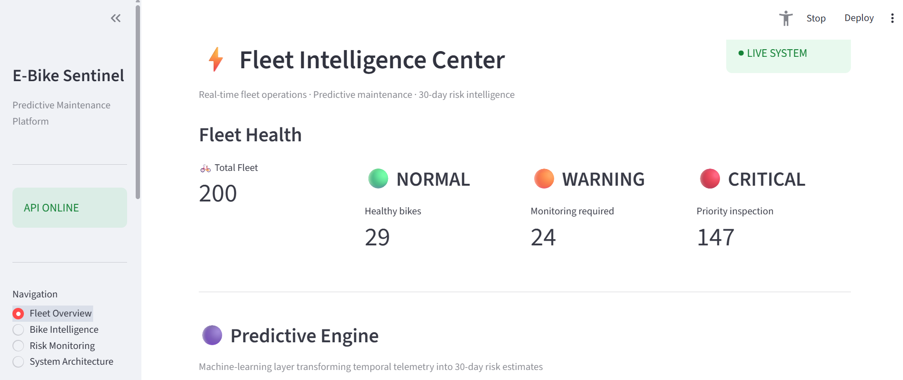
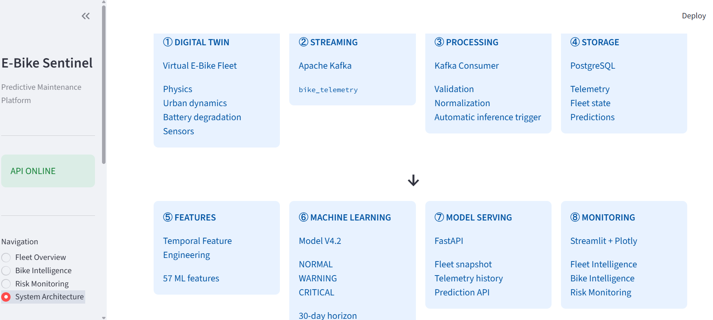
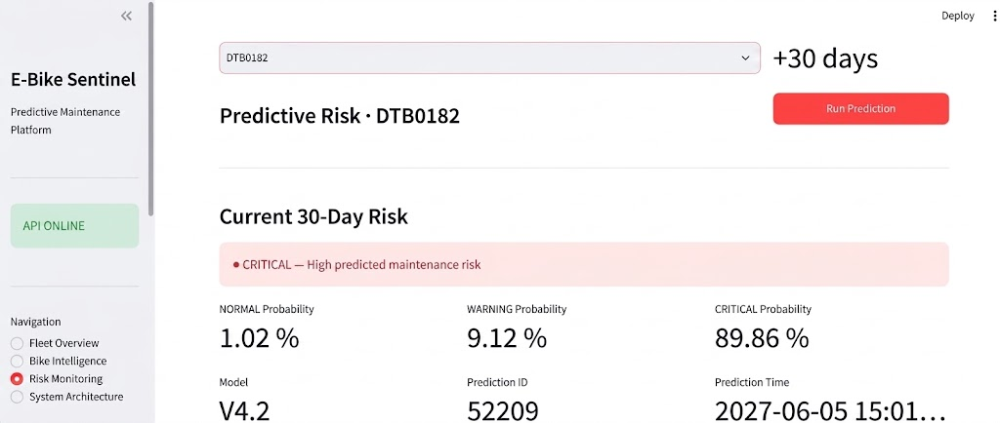
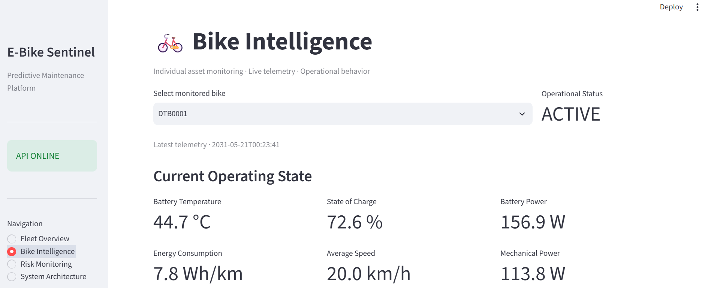
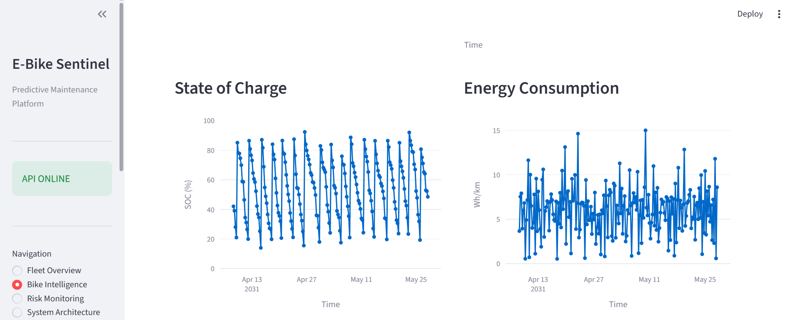

# E-Bike Sentinel

### Real-Time Predictive Maintenance Platform for Smart E-Bike Fleets

E-Bike Sentinel is an end-to-end data engineering and machine learning platform designed to simulate, stream, process, and analyze telemetry from a fleet of smart electric bikes.

The platform combines a physics-based digital twin, Apache Kafka real-time streaming, PostgreSQL storage, temporal feature engineering, machine learning risk prediction, FastAPI model serving, and an interactive Streamlit monitoring dashboard.

The system currently simulates a fleet of **200 virtual e-bikes** and automatically estimates maintenance risk over a **30-day prediction horizon**, classifying each bike as **NORMAL**, **WARNING**, or **CRITICAL**.

> **Note:** The platform uses an accelerated digital-twin simulation clock. Dates displayed in the dashboard represent simulated operational time and should not be interpreted as real-world telemetry dates.

---

## Live Fleet Intelligence




---

## System Architecture

E-Bike Sentinel follows an end-to-end architecture connecting simulation, real-time data streaming, persistent storage, temporal feature engineering, machine learning inference, API serving, and interactive monitoring.

The pipeline is organized into eight main stages:

1. **Digital Twin** - Simulates a fleet of virtual e-bikes using physics, urban dynamics, battery degradation, trips, sensors, and station interactions.
2. **Apache Kafka** - Streams generated telemetry through the `bike_telemetry` topic.
3. **Kafka Consumer** - Validates and normalizes incoming events before triggering downstream processing.
4. **PostgreSQL** - Stores telemetry, fleet state, and generated risk predictions.
5. **Temporal Feature Engineering** - Builds the 57 temporal features required by the predictive model.
6. **Machine Learning** - Model V4.2 estimates maintenance risk over a 30-day horizon using three classes: NORMAL, WARNING, and CRITICAL.
7. **FastAPI** - Exposes fleet state, telemetry history, and prediction services.
8. **Streamlit & Plotly** - Provide interactive fleet monitoring, bike-level intelligence, and risk visualization.



---

## Digital Twin & Real-Time Streaming

The platform includes a physics-based digital twin that generates continuous telemetry for a fleet of 200 virtual e-bikes.

Each simulated bike evolves through operational conditions such as trips, battery usage, charging cycles, environmental conditions, mechanical load, and progressive component degradation.

Telemetry events are continuously published to Apache Kafka through the `bike_telemetry` topic. A dedicated Kafka consumer processes incoming events and persists the resulting telemetry and fleet state in PostgreSQL.

The simulation uses an accelerated operational clock: each observation advances the simulated bike state by six hours, while telemetry events are continuously streamed through the running platform.

This architecture separates simulation time from the real-time data transport layer, allowing long-term degradation scenarios to be evaluated without waiting months of real-world operation.

### Streaming Pipeline

```text
Digital Twin
     |
     v
Telemetry Producer
     |
     v
Apache Kafka
bike_telemetry
     |
     v
Kafka Consumer
     |
     +----> PostgreSQL
     |
     +----> Temporal Features
                  |
                  v
             ML Inference 


---

## Machine Learning Pipeline

E-Bike Sentinel integrates predictive maintenance directly into the streaming architecture. Instead of performing inference on isolated telemetry measurements, the system constructs temporal features from the historical behavior of each bike.

### Temporal Feature Engineering

The prediction pipeline transforms longitudinal telemetry into **57 temporal features** describing the recent operational and degradation history of each e-bike.

These features provide the machine learning model with information derived from the evolution of the bike over time rather than from a single sensor snapshot.

The feature engineering layer is implemented in:

```text
services/feature_builder_V42.py
```

The offline dataset construction pipeline is implemented in:

```text
ml/build_temporal_dataset_30d_V42.py
```

### Predictive Maintenance Model

The current production model is **Model V4.2**, trained to estimate the maintenance risk of each bike over a **30-day prediction horizon**.

The model produces three risk classes:

| Risk Class | Interpretation |
| --- | --- |
| **NORMAL** | No significant maintenance risk detected |
| **WARNING** | Increased degradation or emerging maintenance risk |
| **CRITICAL** | High predicted maintenance risk requiring attention |

The trained model and its metadata are versioned with the project:

```text
models/logistic_temporal_V42.joblib
models/logistic_temporal_V42_metadata.json
```

During live operation, the prediction service reconstructs the required temporal features from stored telemetry and performs automatic model inference.

 


---

## Bike Intelligence & Monitoring

The monitoring layer provides both fleet-level supervision and detailed bike-level analysis through an interactive Streamlit dashboard.

Operators can select an individual e-bike and inspect its latest operational state, including battery temperature, state of charge, battery power, energy consumption, average speed, and mechanical power.



### Telemetry Analysis

Historical telemetry can be explored through interactive time-series visualizations. This makes it possible to inspect the evolution of operational signals and identify patterns such as charging and discharging cycles, changes in energy consumption, and variations in bike usage.



The dashboard therefore connects three levels of information:

- **Fleet level** - Overall distribution of maintenance risk across the simulated fleet.
- **Bike level** - Current operational state and individual telemetry.
- **Prediction level** - 30-day maintenance risk and associated class probabilities.


## Technology Stack

E-Bike Sentinel combines data engineering, machine learning, backend services, and monitoring technologies in a containerized architecture.

| Layer | Technologies |
| --- | --- |
| **Digital Twin & Simulation** | Python |
| **Real-Time Streaming** | Apache Kafka |
| **Stream Processing** | Python, Kafka Consumer |
| **Data Storage** | PostgreSQL, SQLAlchemy |
| **Feature Engineering** | Python, Pandas |
| **Machine Learning** | scikit-learn, Joblib |
| **Model Serving & API** | FastAPI |
| **Monitoring & Visualization** | Streamlit, Plotly |
| **Containerization** | Docker, Docker Compose |
| **Testing** | Pytest |
| **CI/CD** | GitHub Actions |

### Engineering Scope

The project covers the complete lifecycle of a predictive data product: synthetic data generation, real-time ingestion, persistent storage, temporal feature engineering, model training and inference, API serving, visualization, automated testing, and containerized deployment.


---

## Project Structure

The repository is organized by responsibility, separating simulation, streaming, machine learning, serving, monitoring, and testing components.

```text
Smart_EBike_Platform_V2/
|
|-- simulation/              # Digital twin and physical simulation
|   |-- bike_V2.py
|   |-- health_degradation_V2.py
|   |-- physics_engine_V2.py
|   |-- route_planner_V2.py
|   |-- telemetry_generator_V2.py
|   `-- urban_dynamics_V2.py
|
|-- producer/
|   `-- live_telemetry_producer_V42.py
|                              # Real-time Kafka telemetry producer
|
|-- consumer/
|   `-- telemetry_consumer_V42.py
|                              # Kafka telemetry consumer
|
|-- database/
|   `-- db.py                  # PostgreSQL / SQLAlchemy connection
|
|-- services/
|   |-- feature_builder_V42.py
|   `-- prediction_service_V42.py
|                              # Online features and ML inference
|
|-- ml/
|   |-- generate_longitudinal_fleet_V42.py
|   |-- build_temporal_dataset_30d_V42.py
|   |-- final_purged_spatiotemporal_cv_V42.py
|   `-- train_final_model_V42.py
|                              # Offline ML pipeline
|
|-- models/
|   |-- logistic_temporal_V42.joblib
|   `-- logistic_temporal_V42_metadata.json
|                              # Versioned trained model
|
|-- api/
|   `-- main_V42.py            # FastAPI application
|
|-- dashboard/
|   |-- app_V42.py
|   `-- pages_V42/             # Streamlit monitoring pages
|
|-- scripts/
|   `-- diagnostics/           # Operational diagnostic tools
|
|-- tests/                     # Automated test suite
|
|-- docs/
|   `-- screenshots/           # README documentation assets
|
|-- .github/workflows/
|   `-- ci.yml                 # GitHub Actions CI pipeline
|
|-- Dockerfile
|-- docker-compose.yml
|-- requirements.txt
`-- README.md
```

---

## Installation & Running the Platform

### Prerequisites

Before starting the platform, make sure the following tools are available:

- Docker and Docker Compose
- PostgreSQL
- Git

PostgreSQL currently runs on the host machine, while Kafka and the application services run inside Docker containers.

### 1. Clone the Repository

```bash
git clone <repository-url>
cd Smart_EBike_Platform_V2
```

### 2. Configure Environment Variables

Create a local `.env` file from the provided template.

On Windows PowerShell:

```powershell
Copy-Item .env.example .env
```

Then edit `.env` and replace:

```text
POSTGRES_PASSWORD=your_postgresql_password
```

with the password of your local PostgreSQL instance.

The `.env` file is excluded from Git and must never be committed.

### 3. Prepare PostgreSQL

Create the database used by the platform:

```sql
CREATE DATABASE ebike_db;
```

PostgreSQL must be accessible on port `5432`.

Docker services connect to the host database through:

```text
host.docker.internal:5432
```

### 4. Start the Platform

Build and start the complete containerized stack:

```bash
docker compose up --build -d
```

Docker Compose starts the following services:

```text
kafka
producer
consumer
api
dashboard
```

### 5. Access the Applications

Once the containers are running:

| Service | Address |
| --- | --- |
| Streamlit Dashboard | `http://localhost:8501` |
| FastAPI | `http://localhost:8002` |
| FastAPI Documentation | `http://localhost:8002/docs` |
| Kafka External Listener | `localhost:9092` |

### 6. Check Container Status

```bash
docker compose ps
```

The API and Kafka services include health checks, while the producer and consumer continuously participate in the streaming pipeline.


---

## Testing & CI/CD

E-Bike Sentinel includes automated tests covering the main simulation, machine learning, and API components.

The test suite includes validation for:

- API endpoints
- Battery health degradation
- Health sensitivity
- Machine learning inference
- E-bike network behavior
- Route planning
- Telemetry generation
- Urban dynamics

### Run the Tests

From the project root:

```bash
pytest
```

Individual tests can also be executed directly, for example:

```bash
pytest tests/test_model_V42.py
pytest tests/test_api_V42.py
```

### Continuous Integration

The repository includes a GitHub Actions workflow located at:

```text
.github/workflows/ci.yml
```

The CI pipeline provides automated validation of the project when changes are integrated into the repository.